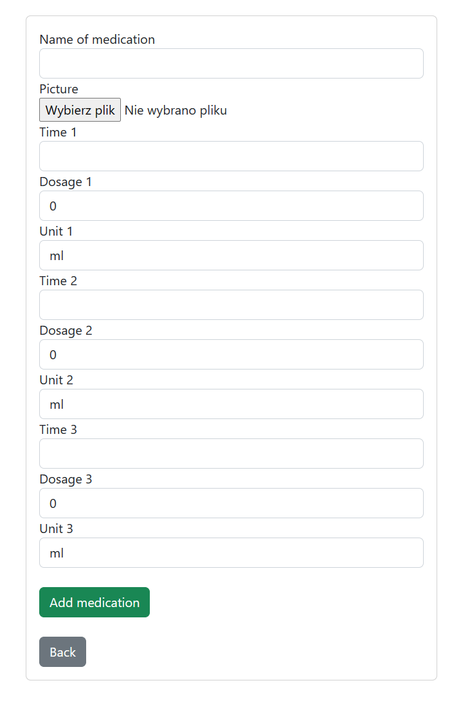
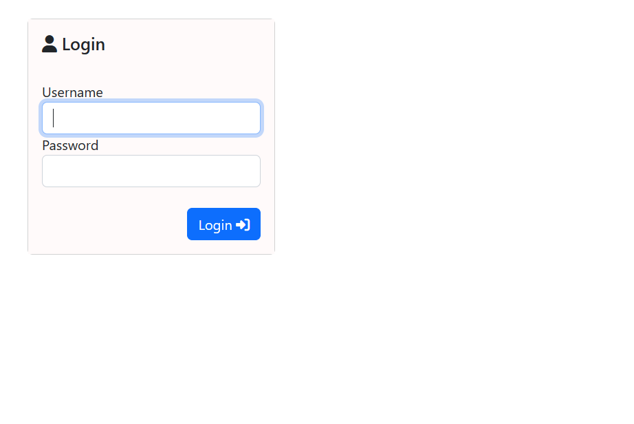

# Medication Schedule

### Concept 
Medication Schedule is an intuitive web application designed to medication management. Once logged in, you can schedule and track medication doses and timings.   
The application is currently in production.

 

### Schedule screen:

  

### Form screen: 

  

### Login screen: 

  

### Used technology:
- Python
- Django
- HTML
- CSS
- Bootstrap
- Fontawesome
- PythonAnywhere

### Requirements and installation
<em>Under construction</em>
  

#### I am making this project for a contest on the Discord channel [Zaprogramuj Życie](https://discord.com/invite/zaprogramujzycie)
While working on this application, I started learning Django, HTML and CSS.
